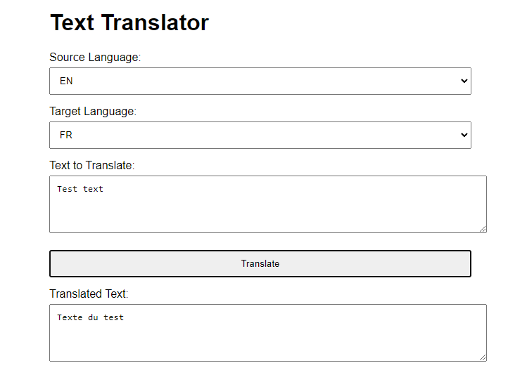

# Здравствуйте!
Приложение написано на Java при помощи Maven с использованием баз данных PostgreSQL.
Сервисом, предоставляющий перевод является DeepL Translator. Был использован фреймворк SpringBoot.
Для запуска приложения понадобятся установленные на компьютер Maven, PostgreSQL.
# Запуск приложения
Для запуска приложения понадобится любым удобным способом создать базу данных
(например pgAdmin 4) на порте 5432. После в файлах application.properties и TLabApplication.java
нужно заменить следующие строки:
* jdbc:postgresql://localhost:5432/TDB - вместо TDB вставить название Вашей БД. (в обоих файлах)
* postgres - заменить именем пользователя, под которым Вы входите в pgAdmin.
* DBPASSWORD - заменить на пароль, который требует pgAdmin при входе.

Все указанные изменения нужно применить к двум вышеупомянутым файлам. Больше никаких трудностей с
запуском приложения возникнуть не должно.
# Способ использования приложения
Для того теста приложения нужно зайти в Вашу среду разработки и запустить основной файл TLabApplication.
После запуска должно пройти какое-то время для загрузки программы. После нужно открыть браузер и ввести 
в адресную строку http://localhost:8080/. 

После этого откроется страница:  После открытия Вам будет доступно на выбор несколько
языков, на которых может быть написан исходный текст. В данном случае выбран английский язык (EN). Вторым 
вариантом выбора является язык, на который, соответственно, будет осуществляться перевод. В данном случае
это французский язык (FR). Следующее поле позволяет Вам ввести текст, который вы хотите перевести. После 
ввода Вы можете нажать кнопку "Translate", после чего в блоке снизу появится текст, переведенный на нужный Вам язык.
